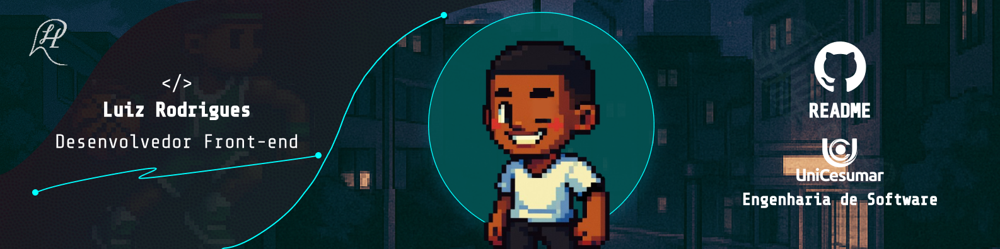

## Olá, eu sou o Luiz Rodrigues! ⚡

 - Desenvolvedor Júnior Front-end com foco em React e Next.js.

 - Boa proficiência em JavaScript e Tailwind, aplicando boas práticas e padrões modernos de desenvolvimento

 - Iniciando o desenvolvimento com TypeScript e Flutter, expandindo para o ecossistema web e mobile

 - Experiência com projetos reais, incluindo manutenção e otimização de sistemas legados

 - Interesse por todo o ecossistema de desenvolvimento — client-side e server-side

 - Atualmente aprimorando conhecimentos em performance, UI/UX e boas práticas de código

## Meus contatos

  
  
  
  
  
  

## Linguagens de Desenvolvimento

 
  
  
  
  
  
  
  
  
  
  

## GitHub Status

  
  

